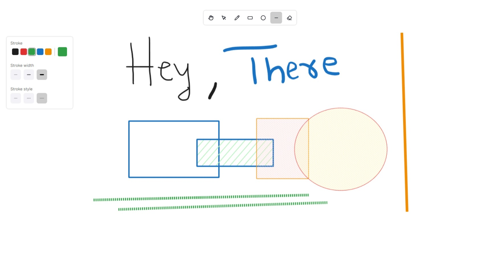

# Excalidraw Clone App

Welcome to the Excalidraw Clone App! This application is a portfolio project designed to showcase a simple and intuitive interface for creating and editing drawings. 

## Technologies Used

This application is built using a variety of modern web technologies:

- **Next.js**: A React framework for building JavaScript applications.
- **TypeScript (TS)**: A statically typed superset of JavaScript that adds types.
- **Tailwind CSS**: A utility-first CSS framework for rapidly building custom user interfaces.
- **Rough.js**: A light-weight library that lets you draw in a sketchy, hand-drawn-like style.
- **Perfect Freehand**: A library for creating smooth, beautiful freehand lines.
- **Recoil**: A state management library for React.

## Features

The app currently supports the following features:

- **Unlimited Panning**: Navigate across the canvas without any restrictions.
- **Drawing Shapes**: Create rectangles, circles, and lines with ease.
- **Moving Objects**: Adjust the position of drawn objects as needed.
- **Freehand Drawing**: Unleash creativity with the freehand drawing tool.
- **Customization**: Adjust stroke width, color, and background color to suit preferences.

## Upcoming Features

There are plans to improve the app and add new features. Here are some of the enhancements to look forward to in future updates:

- **State Persistence**: Save work and continue where left off.
- **Resizing Items**: Adjust the size of drawn objects with a highlighted feature.
- **More Shapes**: Adding more shape options such as arrows and diamonds.
- **Text on Canvas**: Add text annotations directly on the canvas.
- **Image on Canvas**: Import images onto the canvas for reference or enhancement.

Stay tuned for these exciting updates!

## Feedback

Your thoughts on this app are welcome! If you have any suggestions or run into any issues, please let me know.

Thank you for checking out this Excalidraw Clone App!

